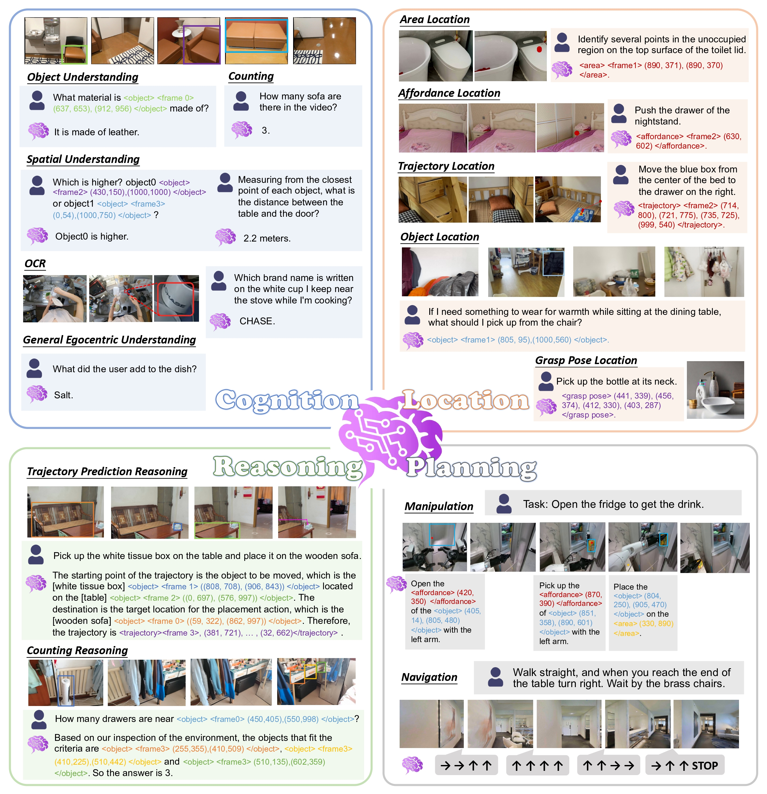
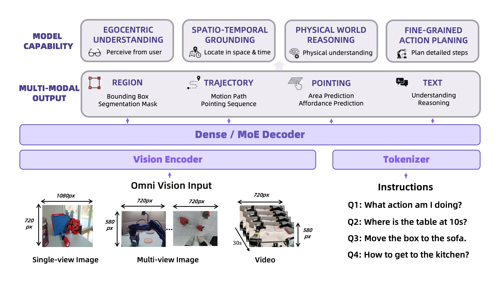

# RynnBrain
<p align="center">

</p>
<p align="center">
        💫 <a href="https://alibaba-damo-academy.github.io/RynnBrain.github.io/"><b>Project Page</b></a>&nbsp&nbsp | &nbsp&nbsp🤗 <a href="https://huggingface.co/collections/Alibaba-DAMO-Academy/rynnbrain">Hugging Face</a>&nbsp&nbsp | &nbsp&nbsp🤖 <a href="https://modelscope.cn/collections/DAMO_Academy/RynnBrain">ModelScope</a>&nbsp&nbsp | &nbsp&nbsp📚 <a href="https://github.com/alibaba-damo-academy/RynnBrain/tree/main/cookbooks">Cookbooks</a>&nbsp&nbsp
</p>

## Introduction
We present **RynnBrain**, an embodied foundation model grounded in physical reality. 
The goal of RynnBrain is not just to "observe" the environment, but to anchor its understanding within the physical world through comprehensive egocentric cognition, precise spatiotemporal grounding and real task planning. 
This systematic upgrade pushes the boundaries of embodied brains, moving them from passive observation toward active, physics-aware reasoning and complex task execution.

Rynnbrain is available in two dense variants (2B and 8B) and one mixture-of-experts (MoE) model (30B-A3B). 
In addition, we release three post‑trained models: RynnBrain‑Plan, RynnBrain‑Nav, and RynnBrain‑CoP. 
<!-- RynnBrain‑Plan demonstrates the effectiveness of the fine‑grained manipulation‑planning paradigm that alternates between textual reasoning and localization. -->
<!-- RynnBrain‑Nav verifies that using RynnBrain as the foundation model can substantially enhance the performance ceiling of various embodied task models.  -->
<!-- Brain-CoP incorporates an interleaved reasoning mechanism that alternates between textual reasoning and spatial grounding, endowing it with physical-space reasoning capabilities.  -->

### 🌟 Key Highlights
* **Comprehensive egocentric understanding**: 
Excels in spatial comprehension and egocentric cognition, encompassing tasks such as embodied QA, counting, and OCR.
* **Diverse spatiotemporal localization**: 
Possesses powerful physical-space localization capabilities, enabling it to locate objects, identify target areas, and predict trajectories across its entire episodic memory.
* **Physical-space reasoning**: 
Employs an interleaved reasoning strategy that alternates between textual and spatial grounding, ensuring that its reasoning processes are firmly rooted in the physical environment.
* **Physics-aware precise planning**: 
Integrates localized affordances and object information into planning, enabling downstream VLA models to execute intricate tasks with precise instructions.

<p align="center">

</p>

### Model Architecture
RynnBrain employs a unified encoder-decoder architecture (supporting both Dense and MoE variants) to transform omni-vision inputs and textual instructions into multi-modal outputs, including spatial trajectories, physical pointing, and action plans. 
By systematically training on rich spatiotemporal, physical-space, and general knowledge data, RynnBrain maintains robust general-purpose capabilities while specializing in diverse, fine-grained embodied reasoning and complex planning tasks.

<p align="center">

</p>

## Performance

- General Embodied Understanding

<p align="center">

</p>
<p align="center">

</p>


- Manipulate Planning

<p align="center">

</p>

- Navigation

<p align="center">

</p>


## Model Zoo

| Model            | Base Model           | Huggingface | Modelscope |
| :--------------- | :------------------- | :---------: | :--------: |
| RynnBrain-2B  | Qwen3-VL-2B-Instruct | [Link](https://huggingface.co/Alibaba-DAMO-Academy/RynnBrain-2B)    | [Link](https://www.modelscope.cn/models/DAMO_Academy/RynnBrain-2B)   |
| RynnBrain-8B  | Qwen3-VL-8B-Instruct | [Link](https://huggingface.co/Alibaba-DAMO-Academy/RynnBrain-8B)    | [Link](https://www.modelscope.cn/models/DAMO_Academy/RynnBrain-8B)   |
| RynnBrain-30B-A3B  | Qwen3-VL-30B-A3B-Instruct | [Link](https://huggingface.co/Alibaba-DAMO-Academy/RynnBrain-30B-A3B)    | [Link](https://www.modelscope.cn/models/DAMO_Academy/RynnBrain-30B-A3B)   |
| RynnBrain‑CoP-8B | RynnBrain-8B         | [Link](https://huggingface.co/Alibaba-DAMO-Academy/RynnBrain-CoP-8B)    | [Link](https://www.modelscope.cn/models/DAMO_Academy/RynnBrain-CoP-8B)   |
| RynnBrain‑Plan-8B | RynnBrain-8B        | [Link](https://huggingface.co/Alibaba-DAMO-Academy/RynnBrain-Plan-8B)    | [Link](https://www.modelscope.cn/models/DAMO_Academy/RynnBrain-Plan-8B)   |
| RynnBrain‑Plan-30B-A3B | RynnBrain-30B-A3B        | [Link](https://huggingface.co/Alibaba-DAMO-Academy/RynnBrain-Plan-30B-A3B)    | [Link](https://www.modelscope.cn/models/DAMO_Academy/RynnBrain-Plan-30B-A3B)   |
| RynnBrain‑Nav-8B | RynnBrain-8B        | [Link](https://huggingface.co/Alibaba-DAMO-Academy/RynnBrain-Nav-8B)    | [Link](https://www.modelscope.cn/models/DAMO_Academy/RynnBrain-Nav-8B)   |


## Quick Start

Minimal dependencies:
```shell
pip install transformers==4.57.1
```
Run text generation:
```python
from transformers import AutoModelForImageTextToText

model = AutoModelForImageTextToText.from_pretrained("")
...
```


## Cookbooks
Checkout the [cookbooks](./cookbooks) that showcase RynnBrain's capabilities in cognition, localization, reasoning, and planning.


| Category             | Cookbook name                                                                                   | Description |
|----------------------|--------------------------------------------------------------------------------------------------|-------------|
| Cognition            | [1_spatial_understanding.ipynb](./cookbooks/1_spatial_understanding.ipynb)                     | Shows the ability of model for spaital understanding in the video scene. |
| Cognition            | [2_object_understanding.ipynb](./cookbooks/2_object_understanding.ipynb)                       | Shows how the model understands object categories, attributes, and relations and counting ability. |
| Cognition            | [3_ocr.ipynb](./cookbooks/3_ocr.ipynb)                                                         | Examples of optical character recognition and text understanding in videos. |
| Location             | [4_object_location.ipynb](./cookbooks/4_object_location.ipynb)                                 | Locates specific objects with bounding boxes in an image or video based on instructions. |
| Location             | [5_area_location.ipynb](./cookbooks/5_area_location.ipynb)                                     | Identifies and marks specified regions by points in an image or video. |
| Location             | [6_affordance_location.ipynb](./cookbooks/6_affordance_location.ipynb)                         | Finds areas or objects with specific affordances in an image of video. |
| Location             | [7_trajectory_location.ipynb](./cookbooks/7_trajectory_location.ipynb)                         | Infers and annotates trajectories or motion paths in an image or video. |
| Location             | [8_grasp_pose.ipynb](./cookbooks/8_grasp_pose.ipynb)                                           | Present the model's abiltiy to predict robotic grasp poses from images. |
| Reasoning            | [9_thinking_with_time_space.ipynb](./cookbooks/9_thinking_with_time_space.ipynb)               | Explores an interleaved reasoning mechanism that alternates between textual reasoning and spatial grounding. |
| Planning | [10_manipulate_planning.ipynb](./cookbooks/10_manipulate_planning.ipynb)                                     | Performs multi-step task decomposition and action planning from goals and scenes. |
| Planning | [11_visual_language_navigation.ipynb](./cookbooks/11_visual_language_navigation.ipynb)         | Combines vision and language instructions to perform navigation and path planning. |


## Training

**Pretraining & Evaluation** 

Please refer to [RynnScale](https://github.com/alibaba-damo-academy/RynnScale) for details of pretraining and evaluation.


**Finetuning**

- [Reasoning](reasoning): RynnBrain introduces an **interleaved reasoning approach that combines grounding with textual information** directly within egocentric video streams. This paradigm effectively bridges the cognitive gap between language and the physical world, ensuring the reasoning process is robustly anchored
in reality. 

- [Navigation](navigation):
We trained a vision-language navigation model based on the RynnBrain base model. Empirical evaluation demonstrates that fine-tuning the vision-language model on RynnBrain yields superior performance compared to fine-tuning on other foundational models.

- [Planning](planning):
RynnBrain **integrates the location information of affordance, areas, and objects directly
into its planning outputs**. Consequently, even highly intricate and fine-grained tasks can be effectively addressed within our hierarchical RynnBrain-VLA system architecture.


## RynnBrain-Bench
We introduce **RynnBrain-Bench**, a high-dimensional benchmark for embodied understanding that evaluates models across four key dimensions: *object cognition*, *spatial cognition*, *grounding*, and *pointing*—highlighting fine-grained understanding and spatiotemporal localization across episodic video sequences.

For details, please refer to [RynnBrain-Bench](./rynnbrain-bench/README.md).
<p align="center">

</p>


